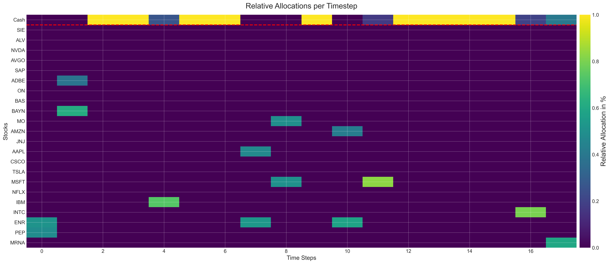
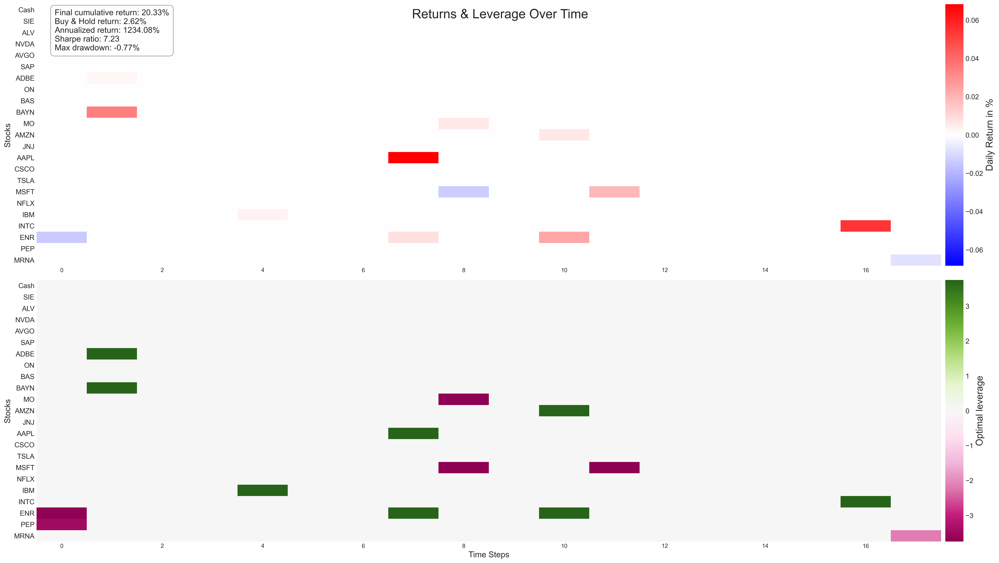

# 🔎 🧠 Stock Market Prediction using LSTM with Causal Attention – an experiment

## Introduction

Currently transformers are very powerful tools used across various tasks. Since many current projects run with transformers, I want to learn exactly how they work and deepen my knowledge of machine learning in general. The main purpose and strength of transformers are clearly LLM's, but what else can it do? That is what I want to explore in this project where we are going to transform a time series into a probability distribution and finally use it to calculate a portfolio allocation.

`attention-stock-predictor` is a PyTorch-based transformer model designed for experimenting with stock market predictions using multi-stock OHLCV data. Although it does **not reliably predict next-day returns**, it showcases advanced techniques like probability distribution modeling, Wasserstein loss, and allocation-based evaluation—highlighting technical depth in applying modern deep learning to financial time series.

## ✨ Highlights

🔎 Experiment-focused: Learn how attention behaves on time series
📊 Financial data pipeline: Automated OHLCV download via Alpha Vantage
🎯 Probability modeling: Target distributions instead of point predictions
📐 Wasserstein loss: More meaningful training for distributions
📈 Portfolio-style evaluation: Allocation, returns, drawdown, Sharpe ratio
🛠️ Custom optimizer: Arbitrary momentum scheduling

## 📜 Table of Contents

- [Quickstart](#quickstart)
- [API Key Setup](#api-key-setup)
- [Features](#features)
- [Project Structure](#project-structure)
- [Configuration](#configuration)
- [Data Pipeline](#data-pipeline)
- [What You’ll Learn](#-what-youll-learn)
- [Evaluation](#evaluation)
- [Example Outputs](#example-outputs)
- [Troubleshooting](#troubleshooting)
- [License](#license)

## 🚀 Quickstart

### 1. Clone repo
```bash
git clone https://github.com/SATheinen/attention-stock-predictor.git
cd attention-stock-predictor
```

### 2. Create environment
Tested in Python 3.12.5
```bash
python -m venv venv
source venv/bin/activate
pip install -r requirements.txt
```

### 3. Add API key
```bash
echo 'api_key = "YOUR_KEY"' > api_key.txt
```

### 4. Fetch data
```bash
python data/get_data.py
```

### 5. Train model (open notebook)
```bash
jupyter-notebook model/lstm.ipynb
```

## 🔑 API Key Setup

To download or update stock data, this project uses the [Alpha Vantage API](https://www.alphavantage.co/). You need to provide your own API key.

1. Register at [Alpha Vantage](https://www.alphavantage.co/support/#api-key)
2. Create a file named `api_key.txt` in the project root
3. Paste your API key into this file

```txt
api_key = "************"
```

**Important:** Do not share this file or include it in version control.

## ✨ Features

- Transformer model for multi-stock prediction
- Sequence-to-distribution prediction using triangular probability targets
- Wasserstein loss for training
- Forward testing via allocation-based evaluation
- Custom optimizer with arbitrary momentum scheduling
- Metrics: annualized return, drawdown, Sharpe ratio

## 🏗️ Project Structure

```
.
├── api_key.txt                # User-provided API key for Alpha Vantage
├── data/
│   ├── data_dump/             # Saved OHLCV datasets
│   ├── get_data.py            # Script to fetch stock data
│   └── stock_names.txt        # List of stocks to fetch
├── model/
│   └── lstm.ipynb             # Main notebook with model training
├── requirements.txt           # Python dependencies
└── README.md                  # This file
```

## ⚙️ Configuration

- API Key: `api_key.txt`
- List of Stocks: `data/stock_names.txt`
- Dataset Path: `data/data_dump/`
- All hyperparameters and training controls are in the notebook.

## 🔢 Data Pipeline

- Stock data (OHLCV) is downloaded via Alpha Vantage.
- Daily percentage changes are computed.
- Hard classification targets are mapped to triangular distributions.
- A sequence of metrics across all stocks is fed to the model.
- Training occurs in two phases:
  1. On training set for several rounds
  2. One forward online learning run on unseen test set

## 🧠 What You’ll Learn
- How to preprocess financial data into model-ready sequences
- Why triangular probability targets can help vs. one-hot
- How to apply causal attention in a non-language setting
- How to evaluate models like portfolios, not just with accuracy

## 📊 Evaluation

- Convert output distributions to stock allocations
- Compute:
  - Daily returns
  - Annualized return
  - Maximum drawdown
  - Sharpe ratio
- Evaluation handled by external post-processing script

## 📈 Example Outputs
(plots and results will be generated in the notebook)

Relative allocations over time:



Returns and optimal leverage heatmaps:



## ❗ Troubleshooting
⏳ Slow training → MPS/CPU fallback, try fewer epochs
🔑 API errors → Check Alpha Vantage key & rate limits
🗒 Empty data → Verify tickers in stock_names.txt

## 📜 License
MIT License – free to use, adapt, and learn from.